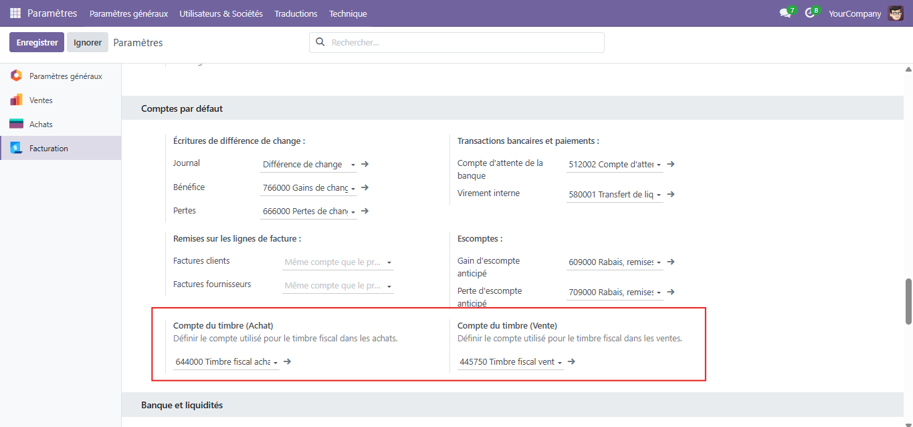
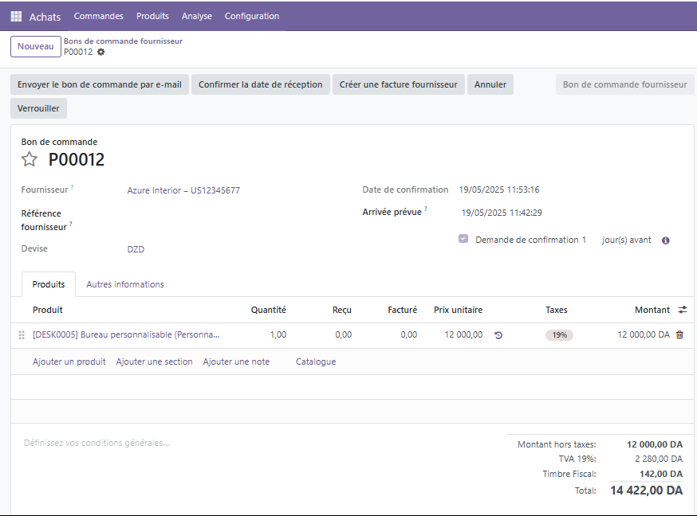
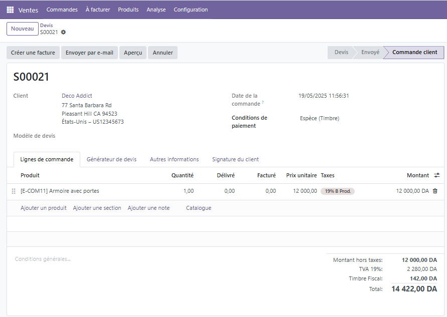
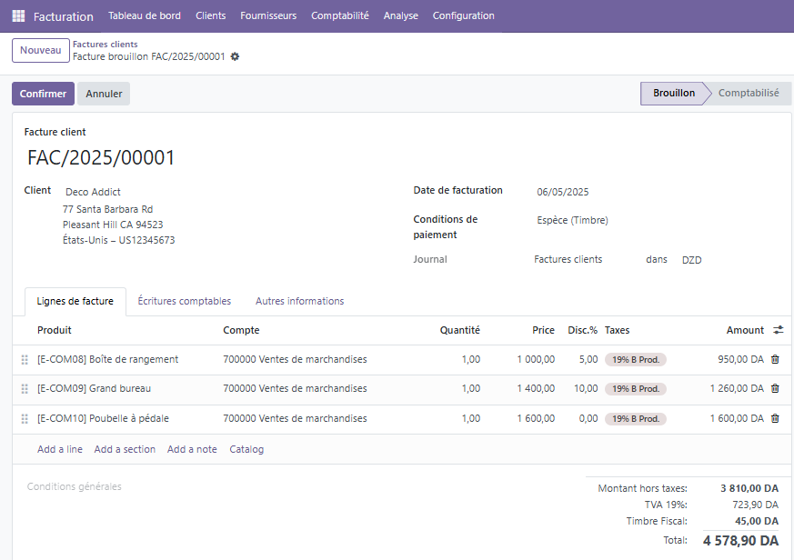
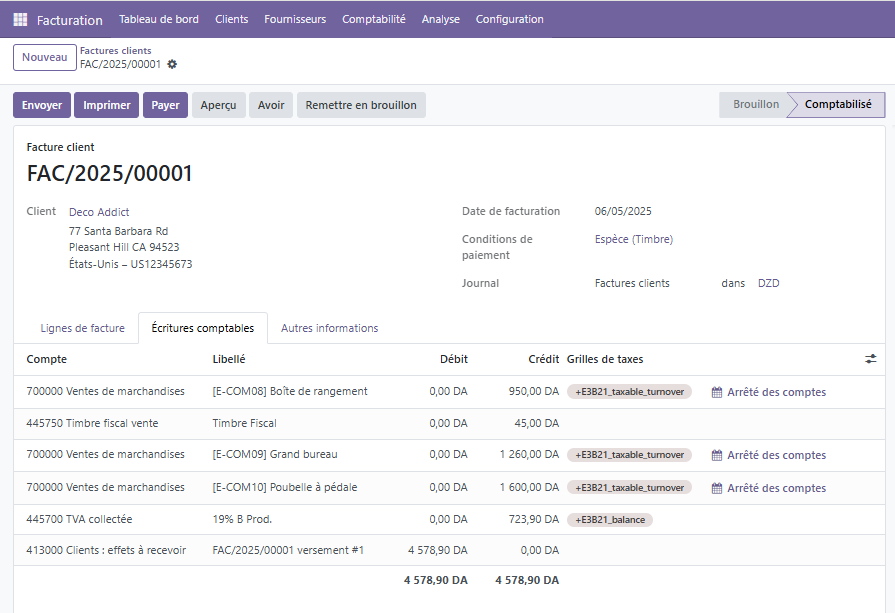

# 📦 Timbre Fiscal – Calcul et comptabilisation automatique  
### *Conforme à la Loi de Finances 2025 (Algérie)*

> **Module Odoo 18 – by [OPENNEXT Technology](https://www.opennext-dz.com)**

---

Ce module permet la **gestion automatique du timbre fiscal** sur Odoo 18, selon les dispositions de la **Loi de Finances 2025**.
Il permet de:
- 💰 Calculer automatiquement le **montant du timbre** si le mode de paiement est "Espèce".
- 🧾 L'intègrer à la **facture client / fournisseur / avoir**.
- 📊 Comptabiliser automatiquement le montant du timbre dans le bon compte.
- 🖨️ Afficher le timbre sur les factures PDF.

---

Ce module permet la gestion automatique du timbre fiscal sur odoo 18 selon les dispositions de la Loi de Finances 2025. Il calcule le timbre en fonction du montant de la facture et du mode de paiement, et ajoute automatiquement les écritures comptables correspondantes dans les factures concernées (paiement en espèce). Le montant du timbre est aussi affiché clairement sur la facture client et fournisseur.

**Configuration**
=============

Avant utilisation, le module nécessite une configuration simple des comptes comptables à utiliser pour la comptabilisation du timbre fiscal.

1. Aller dans **Paramètres** > **Facturation** > **Compte par défaut**
2. Définir :
   - Le **compte timbre pour les ventes**
   - Le **compte timbre pour les achats**

💡 Ces comptes seront utilisés automatiquement lors de la validation des factures en espèce pour enregistrer le montant du timbre.

📸

**Utilisation**
===========

Le module applique automatiquement le timbre fiscal dès que le mode de paiement "Espèce (Timbre)" est sélectionné sur les documents suivants :

1. Commande d’achat
Une fois la condition de paiement "Espèce (Timbre)" sélectionnée, le montant du timbre est automatiquement calculé et affiché.

📸 Capture d’écran ici :

2. Commande de vente
Le timbre est appliqué sur la commande de vente dès que le terme de paiement en espèce est choisi.

📸 Capture d’écran ici :

3. Factures et Avoirs
Lors de la création d'une facture client, d'une facture fournisseur, d'un avoir client ou d'un avoir fournisseur, le montant du timbre est automatiquement calculé et affiché si le mode de paiement sélectionné est Espèce (Timbre).

📸 Capture d’écran ici :

🔄 Mise à jour de l'écriture comptable
Le compte défini dans les paramètres (vente ou achat) est utilisé automatiquement dans l’écriture comptable générée.

📸 Capture d’écran ici :

🔭 **Perspectives d’évolution :**
=============================
Ce module constitue une version fonctionnelle centrée sur la gestion automatique du timbre fiscal conformément à la LF 2025. Plusieurs améliorations sont envisagées pour enrichir ses fonctionnalités, notamment :

- ✅ Support multilingue, avec une traduction complète en anglais et en arabe pour faciliter son adoption par un public plus large.

- 🧾 Ajout de rapports spécifiques, comme un état récapitulatif du montant des timbres appliqués sur une période donnée.

L’objectif est d’évoluer vers une solution complète, personnalisable et conforme aux exigences réglementaires algériennes tout en s’adaptant aux besoins spécifiques de chaque entreprise.

## 🛠 Mainteneurs :

Ce module est maintenu par **[OPENNEXT Technology](https://www.opennext-dz.com)**, intégrateur de solutions informatiques, spécialisé dans la mise en place, le développement et l’intégration de solutions de gestion d’entreprise basées sur **Odoo**.

Nous accompagnons les entreprises dans leur transformation numérique à travers des solutions adaptées, robustes et conformes à la législation algérienne.

📧 Pour toute demande de support, personnalisation ou contribution :  
**contact@opennext-dz.com**  
🌐 [www.opennext-dz.com](https://www.opennext-dz.com)
